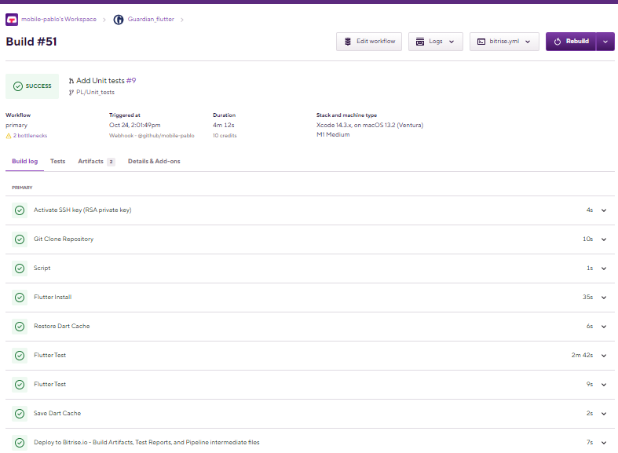
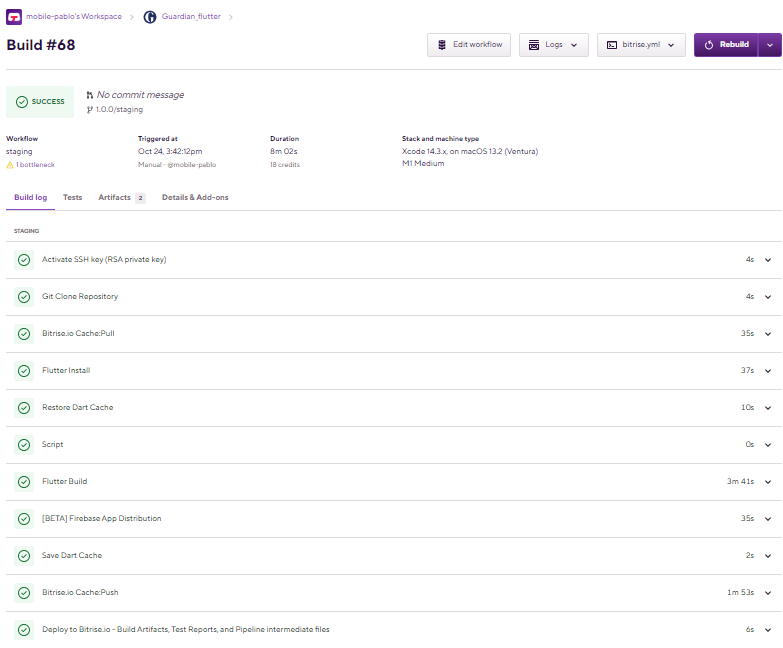
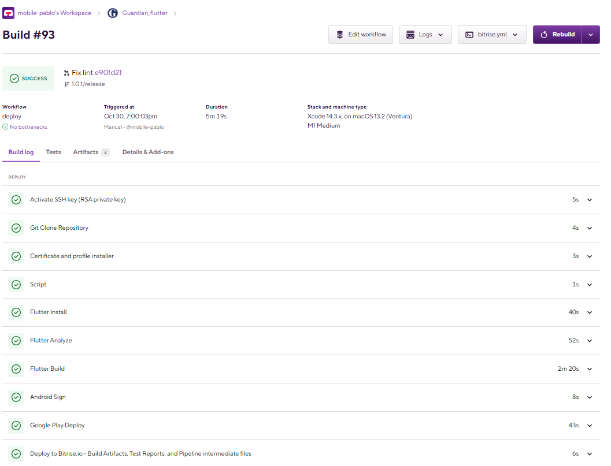
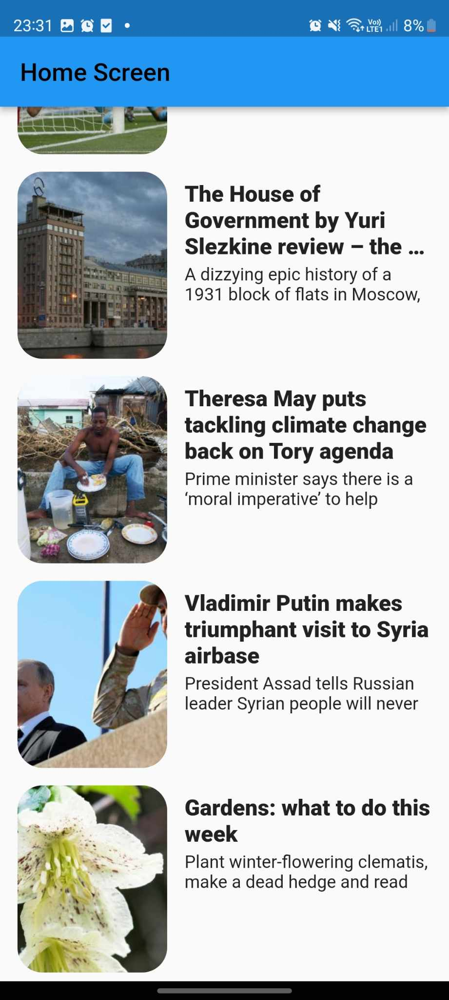
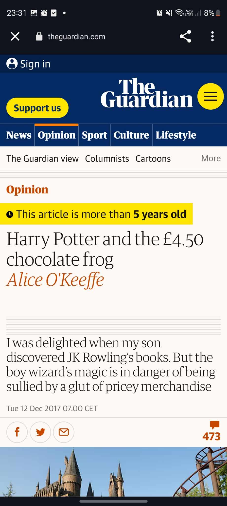

# 📰​ Guardian   

Small news app based on flutter

  
 

## 🛠️​ Tech stack
* <h4>Drift </h4>
* <h4>Hooks</h4>
* <h4>Retrofit + Dio</h4>
* <h4>Bloc</h4>
* <h4>GetIt + Injectable</h4>
* <h4>Freezed</h4>
* <h4>Equatable</h4>
* <h4>Auto Mappr</h4>
* <h4>Tests | Coverage  	████████░░ 80% </h4>

    * <h5> Mocktail </h5>
    * <h5> Mockito</h5>
    * <h5> Bloc Test</h5>
    * <h5> Drift</h5>
    
* <h4> Bitrise CI/CD </h4>

    * <b>CI</b>  <i>(primary workflow)</i>  with integration, widget and unit tests on <b>develop</b> branch

    * <b>CD</b>  <i>(staging workflow)</i> deploy to Firebase App Distribution on <b>x.y.z/staging</b> branch

    * <b>CD</b>  <i>(deploy workflow)</i>  with deploy to Google Play on <b>master</b> branch
* <h4>Github Actions </h4>

    * Delete Branch
    * Lint
    * Mark stale issues

### 🚨​ How to run
    
To build and run this project:

1. Get Flutter [here](https://flutter.dev) if you don't already have it. Configure environment.
2. Clone this repository.
3. `cd` into the repo folder.
4. Run `flutter build` to build the app.

(Please note that a Mac with XCode is required to build for iOS)

###  📸​ Images

   * CI/CD
        * <b>CI</b> <i>(primary)</i>
            
  

        * <b>CD</b> <i>(staging)</i>

            
  

        * <b>CD</b> <i>(deploy)</i>

            
  

   * Preview
        * <b>Home Screen</b> <i>views</i>

            
  

        * <b>Home Screen</b> <i>web view</i>

            
  

